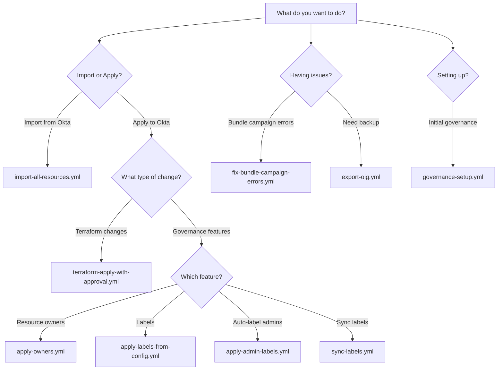

# Workflows Guide - Which Workflow When?

**Problem:** 12 workflows, which one do I use?

**Solution:** This guide! Find your task below and we'll tell you exactly which workflow to run.

---

## 🎯 Quick Task Finder

### Common Tasks

| I want to... | Workflow to Use | Time |
|-------------|-----------------|------|
| **Import my Okta org** | `import-all-resources.yml` | 5 min |
| **Apply my changes** | `terraform-apply-with-approval.yml` | 3 min |
| **Sync resource owners** | `apply-owners.yml` | 2 min |
| **Manage labels** | `apply-labels-from-config.yml` | 2 min |
| **Auto-label admin stuff** | `apply-admin-labels.yml` | 3 min |
| **Export for backup** | `export-oig.yml` | 2 min |
| **Fix bundle errors** | `fix-bundle-campaign-errors.yml` | 5 min |

---

## 📊 Decision Tree



---

## 🔥 Most Common Workflows

### 1. Import All Resources

**When to use:**
- First time setup
- Weekly drift detection
- After manual changes in Okta Admin Console
- Want to sync code with Okta

**Workflow:** `import-all-resources.yml`

**What it does:**
1. Fetches entitlement bundles from Okta API
2. Fetches access reviews from Okta API
3. Generates Terraform `.tf` files
4. Syncs resource owners to JSON
5. Syncs governance labels to JSON
6. Optionally commits changes to repository

**How to run:**

```bash
# Via GitHub CLI
gh workflow run import-all-resources.yml \
  -f tenant_environment=MyEnvironment \
  -f update_terraform=true \
  -f commit_changes=true

# Or use GitHub web UI:
# Actions → Import All OIG Resources → Run workflow
```

**Parameters:**
- `tenant_environment` (required): Your GitHub Environment name
- `update_terraform` (optional): Generate Terraform files (default: true)
- `commit_changes` (optional): Auto-commit results (default: false)

**Expected time:** 5-10 minutes depending on org size

**Output:**
- `environments/{env}/terraform/oig_entitlements.tf`
- `environments/{env}/terraform/oig_reviews.tf`
- `environments/{env}/config/owner_mappings.json`
- `environments/{env}/config/label_mappings.json`
- `environments/{env}/imports/*.json` (raw API data)

---

### 2. Apply Terraform Changes

**When to use:**
- After merging PR with Terraform changes
- Want to create/update/delete Okta resources
- Applying entitlement bundle definitions
- Applying access review configurations

**Workflow:** `terraform-apply-with-approval.yml`

**What it does:**
1. Checks out your code
2. Initializes Terraform with S3 backend
3. Runs terraform plan
4. **Waits for manual approval** (if environment protection enabled)
5. Runs terraform apply
6. Posts results

**How to run:**

```bash
# Via GitHub CLI
gh workflow run terraform-apply-with-approval.yml \
  -f environment=myenvironment

# Or use GitHub web UI:
# Actions → Terraform Apply with Approval → Run workflow
```

**Parameters:**
- `environment` (required): Your environment name (lowercase)

**⚠️ Important:**
- Requires GitHub Environment configured
- May require approval if protection rules enabled
- Always review plan output before approving
- Cannot be undone easily (use with caution)

**Expected time:** 3-5 minutes + approval wait time

---

### 3. Apply Resource Owners

**When to use:**
- Assign owners to apps, groups, or bundles
- After editing `owner_mappings.json`
- Initial governance setup
- Updating ownership assignments

**Workflow:** `apply-owners.yml`

**What it does:**
1. Reads `environments/{env}/config/owner_mappings.json`
2. Calls Okta API to assign owners to resources
3. Reports success/failure for each assignment

**How to run:**

```bash
# Dry-run first (shows what would change)
gh workflow run apply-owners.yml \
  -f environment=myenvironment \
  -f dry_run=true

# Review output, then apply for real
gh workflow run apply-owners.yml \
  -f environment=myenvironment \
  -f dry_run=false
```

**Parameters:**
- `environment` (required): Your environment name
- `dry_run` (optional): Preview without applying (default: true)

**Expected time:** 2-3 minutes

**⚠️ Important:**
- Always run dry-run first
- Review `owner_mappings.json` format carefully
- Owners must exist in Okta
- ORNs must be valid

---

### 4. Apply Labels from Config

**When to use:**
- Apply governance labels to resources
- After editing `label_mappings.json`
- Initial label setup
- Updating label assignments

**Workflow:** `apply-labels-from-config.yml`

**What it does:**
1. **Auto-triggered on merge to main** (dry-run mode)
2. Reads `environments/{env}/config/label_mappings.json`
3. Validates label configuration
4. Applies labels to resources via Okta API
5. Reports results

**Auto-dry-run behavior:**
When you merge changes to `label_mappings.json`:
- Workflow runs automatically in dry-run mode
- Posts what WOULD change (doesn't actually apply)
- Review output, then manually trigger apply

**How to run manually:**

```bash
# Manual apply after reviewing auto-dry-run
gh workflow run apply-labels-from-config.yml \
  -f environment=myenvironment \
  -f dry_run=false
```

**Parameters:**
- `environment` (required): Your environment name
- `dry_run` (optional): Preview without applying (default: true)

**Expected time:** 2-4 minutes

**⚠️ Best Practice:**
1. Edit `label_mappings.json`
2. Create PR → validate-label-mappings.yml runs (syntax check)
3. Merge PR → apply-labels-from-config.yml runs (auto dry-run)
4. Review dry-run output
5. Manually trigger apply with `dry_run=false`

---

## 🔧 Utility Workflows

### 5. Auto-Label Admin Entitlements

**When to use:**
- Automatically find and label admin entitlements
- Don't want to manually identify admin resources
- Initial governance setup
- Regular maintenance

**Workflow:** `apply-admin-labels.yml`

**What it does:**
1. Scans entitlement bundles for "admin" keywords
2. Identifies likely admin/privileged resources
3. Applies "Privileged" or similar label
4. Reports what was labeled

**How to run:**

```bash
# Dry-run first
gh workflow run apply-admin-labels.yml \
  -f environment=myenvironment \
  -f dry_run=true

# Apply for real
gh workflow run apply-admin-labels.yml \
  -f environment=myenvironment \
  -f dry_run=false
```

**Parameters:**
- `environment` (required): Your environment name
- `dry_run` (optional): Preview without applying (default: true)

**Expected time:** 3-5 minutes

**⚠️ Note:**
- Uses keyword matching (may have false positives/negatives)
- Review dry-run output carefully
- Can customize keywords in script

---

### 6. Sync Labels

**When to use:**
- Sync current labels FROM Okta TO config file
- Before editing labels (get current state)
- Drift detection for labels
- Backup current label assignments

**Workflow:** `sync-labels.yml`

**What it does:**
1. Fetches all governance labels from Okta
2. Fetches label assignments for resources
3. Updates `label_mappings.json` with current state
4. Commits changes to repository

**How to run:**

```bash
gh workflow run sync-labels.yml \
  -f environment=myenvironment \
  -f commit_changes=true
```

**Parameters:**
- `environment` (required): Your environment name
- `commit_changes` (optional): Auto-commit results (default: false)

**Expected time:** 2-3 minutes

**Use case:**
```bash
# 1. Sync current state
gh workflow run sync-labels.yml -f environment=myenv -f commit_changes=true

# 2. Edit label_mappings.json with changes

# 3. Create PR and merge

# 4. Apply changes
gh workflow run apply-labels-from-config.yml -f environment=myenv -f dry_run=false
```

---

### 7. Export OIG Resources

**When to use:**
- Backup governance configurations
- Audit current state
- Compare configurations across environments
- Troubleshooting

**Workflow:** `export-oig.yml`

**What it does:**
1. Exports entitlement bundles to JSON
2. Exports access reviews to JSON
3. Exports resource owners to JSON
4. Exports governance labels to JSON
5. Creates timestamped archive
6. Uploads as workflow artifact

**How to run:**

```bash
gh workflow run export-oig.yml \
  -f environment=myenvironment \
  -f export_labels=true \
  -f export_owners=true
```

**Parameters:**
- `environment` (required): Your environment name
- `export_labels` (optional): Include labels (default: true)
- `export_owners` (optional): Include owners (default: true)

**Expected time:** 2-3 minutes

**Output:**
- Workflow artifact: `oig-export-{timestamp}.zip`
- Contains JSON files for all resources
- Retained for 90 days

---

### 8. Fix Bundle Campaign Errors

**When to use:**
- Terraform plan shows "error reading campaign" for bundles
- After deleting access review campaigns
- Provider bug with stale campaign associations
- Can't run terraform plan successfully

**Workflow:** `fix-bundle-campaign-errors.yml`

**What it does:**
1. Identifies bundles with stale campaign references
2. Removes invalid campaign associations via API
3. Re-imports affected bundles
4. Updates Terraform state

**How to run:**

```bash
# Dry-run first (shows which bundles affected)
gh workflow run fix-bundle-campaign-errors.yml \
  -f environment=myenvironment \
  -f dry_run=true \
  -f bundles_to_fix=all

# Apply fix
gh workflow run fix-bundle-campaign-errors.yml \
  -f environment=myenvironment \
  -f dry_run=false \
  -f bundles_to_fix=all
```

**Parameters:**
- `environment` (required): Your environment name
- `dry_run` (optional): Preview without fixing (default: true)
- `bundles_to_fix` (optional): Comma-separated bundle IDs or "all" (default: all)

**Expected time:** 5-10 minutes

**See also:** [TROUBLESHOOTING_ENTITLEMENT_BUNDLES.md](./TROUBLESHOOTING_ENTITLEMENT_BUNDLES.md)

---

### 9. Governance Setup

**When to use:**
- Initial OIG configuration
- Setting up governance from scratch
- Creating baseline labels and owners
- First-time OIG enablement

**Workflow:** `governance-setup.yml`

**What it does:**
1. Creates standard governance labels
2. Sets up resource owner assignments
3. Configures initial label assignments
4. Creates baseline configuration files

**How to run:**

```bash
gh workflow run governance-setup.yml \
  -f environment=myenvironment \
  -f create_labels=true \
  -f assign_owners=true
```

**Parameters:**
- `environment` (required): Your environment name
- `create_labels` (optional): Create standard labels (default: true)
- `assign_owners` (optional): Assign default owners (default: false)

**Expected time:** 5-7 minutes

**⚠️ Note:**
- Run once per environment
- Creates opinionated baseline
- Customize afterwards via config files

---

## 🤖 Auto-Triggered Workflows

These run automatically, no manual trigger needed.

### 10. Terraform Plan (Auto on PR)

**Workflow:** `terraform-plan.yml`

**Triggers:**
- Automatically on pull request
- Automatically on push to main

**What it does:**
1. Runs terraform plan
2. Posts results as PR comment
3. Validates Terraform syntax
4. Shows what would change

**No manual action needed** - just create PR!

---

### 11. Validate PR

**Workflow:** `validate-pr.yml`

**Triggers:**
- Automatically on pull request

**What it does:**
1. Validates YAML syntax in workflow files
2. Runs security scans
3. Validates repository structure
4. Checks for common issues

**No manual action needed** - runs on every PR!

---

### 12. Validate Label Mappings

**Workflow:** `validate-label-mappings.yml`

**Triggers:**
- Automatically on pull request (if label_mappings.json changed)

**What it does:**
1. Validates JSON syntax
2. Checks ORN formats
3. Validates required fields
4. Ensures no duplicate label IDs

**No manual action needed** - runs when you edit labels!

---

## 📋 Workflow Cheat Sheet

Print this for quick reference:

```
TASK                              | WORKFLOW
------------------------------------------------------------------
Import from Okta                  | import-all-resources.yml
Apply Terraform changes           | terraform-apply-with-approval.yml
Assign resource owners            | apply-owners.yml
Apply governance labels           | apply-labels-from-config.yml
Auto-label admin entitlements     | apply-admin-labels.yml
Sync labels from Okta             | sync-labels.yml
Export for backup                 | export-oig.yml
Fix bundle campaign errors        | fix-bundle-campaign-errors.yml
Initial governance setup          | governance-setup.yml
------------------------------------------------------------------
AUTO-TRIGGERED (no manual action needed):
- terraform-plan.yml              | On PR/push
- validate-pr.yml                 | On PR
- validate-label-mappings.yml     | On PR (label changes)
```

---

## 🎯 Common Workflow Sequences

### Sequence 1: First-Time Setup

```bash
# 1. Import existing resources
gh workflow run import-all-resources.yml \
  -f tenant_environment=MyEnvironment \
  -f commit_changes=true

# 2. Set up initial governance
gh workflow run governance-setup.yml \
  -f environment=myenvironment

# 3. Apply to Okta
gh workflow run terraform-apply-with-approval.yml \
  -f environment=myenvironment
```

### Sequence 2: Making Changes

```bash
# 1. Make changes locally
vim environments/myenv/terraform/oig_entitlements.tf

# 2. Create PR (terraform-plan.yml runs automatically)
gh pr create

# 3. Merge after approval

# 4. Apply changes
gh workflow run terraform-apply-with-approval.yml \
  -f environment=myenv
```

### Sequence 3: Updating Labels

```bash
# 1. Sync current state
gh workflow run sync-labels.yml \
  -f environment=myenv \
  -f commit_changes=true

# 2. Edit label config
vim environments/myenv/config/label_mappings.json

# 3. Create PR (validate-label-mappings.yml runs automatically)
gh pr create

# 4. Merge (apply-labels-from-config.yml auto-runs in dry-run mode)

# 5. Review dry-run output, then apply
gh workflow run apply-labels-from-config.yml \
  -f environment=myenv \
  -f dry_run=false
```

### Sequence 4: Weekly Maintenance

```bash
# 1. Detect drift
gh workflow run import-all-resources.yml \
  -f tenant_environment=MyEnv \
  -f commit_changes=false  # Review first

# 2. Export backup
gh workflow run export-oig.yml \
  -f environment=myenv

# 3. Review differences and decide:
#    - Update Terraform to match Okta, or
#    - Revert Okta to match Terraform
```

---

## ❓ Common Questions

### Q: Which workflow runs terraform apply?

**A:** `terraform-apply-with-approval.yml`

This is the ONLY workflow that applies Terraform changes to Okta.

### Q: Why doesn't merging to main automatically apply?

**A:** Safety! We use manual approval gates to prevent accidental changes.

Workflow: Review plan → Approve → Apply

### Q: Can I run workflows locally?

**A:** Terraform yes, full workflows no.

```bash
# Run Terraform locally
cd environments/myenv/terraform
terraform plan
terraform apply

# Workflows require GitHub Actions environment
```

### Q: How do I know what a workflow will do before running?

**A:** Most workflows have `dry_run` parameter:

```bash
# See what would happen
gh workflow run apply-owners.yml -f environment=myenv -f dry_run=true

# Review output in Actions tab

# Then apply for real
gh workflow run apply-owners.yml -f environment=myenv -f dry_run=false
```

### Q: What if a workflow fails?

**A:** Check the workflow run logs:

1. Go to Actions tab
2. Click the failed run
3. Click the failed step
4. Read error message
5. See [05-TROUBLESHOOTING.md](./05-TROUBLESHOOTING.md)

---

## 📚 Related Documentation

- [01-GETTING-STARTED.md](./01-GETTING-STARTED.md) - Daily workflow examples
- [GITOPS_WORKFLOW.md](./GITOPS_WORKFLOW.md) - GitOps patterns in depth
- [WORKFLOWS.md](./WORKFLOWS.md) - Detailed workflow reference
- [05-TROUBLESHOOTING.md](./05-TROUBLESHOOTING.md) - Fixing workflow issues

---

## Summary

**12 workflows, 3 categories:**

**Core (Use regularly):**
- import-all-resources.yml
- terraform-apply-with-approval.yml
- apply-owners.yml
- apply-labels-from-config.yml

**Utility (Occasional):**
- apply-admin-labels.yml
- sync-labels.yml
- export-oig.yml
- fix-bundle-campaign-errors.yml
- governance-setup.yml

**Auto-triggered (No action needed):**
- terraform-plan.yml
- validate-pr.yml
- validate-label-mappings.yml

**Need help deciding?** → See [Decision Tree](#-decision-tree) above!
